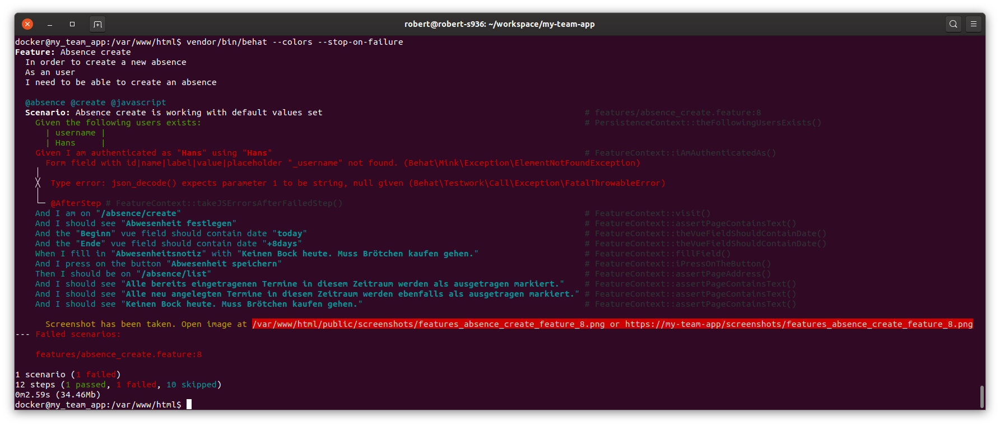

# ImageDriver-URL for Behat-ScreenshotExtension

[](https://packagist.org/packages/robertfausk/behat-screenshot-image-driver-url)
[](https://packagist.org/packages/robertfausk/behat-screenshot-image-driver-url)
[](https://packagist.org/packages/robertfausk/behat-screenshot-image-driver-url)
[](https://packagist.org/packages/robertfausk/behat-screenshot-image-driver-url)
[](https://travis-ci.org/robertfausk/behat-screenshot-image-driver-url)
[](https://scrutinizer-ci.com/g/robertfausk/behat-screenshot-image-driver-url/)
[](https://scrutinizer-ci.com/g/robertfausk/behat-screenshot-image-driver-url/)
[](LICENSE)

[](https://github.com/robertfausk/behat-screenshot-image-driver-url/issues)
[](https://github.com/robertfausk/behat-screenshot-image-driver-url/issues?q=is%3Aissue+is%3Aclosed)
[](https://github.com/robertfausk/behat-screenshot-image-driver-url/graphs/contributors)


This package is an image driver for the [bex/behat-screenshot](https://github.com/elvetemedve/behat-screenshot) behat extension which can upload the screenshot to local web server dir and print the url of the uploaded image.
If you are in a docker like environment then this extension provide the url in log output. 

## Installation


Install by adding to your `composer.json`:

```bash
composer require --dev robertfausk/behat-screenshot-image-driver-url
```

## Configuration

Enable the image driver in the Behat-ScreenshotExtension's config in `behat.yml`:

```yml
default:
  extensions:
    Bex\Behat\ScreenshotExtension:
      active_image_drivers: url
```

You have to choose where to upload files and the web address:

```yml
default:
    extensions:
        Bex\Behat\ScreenshotExtension:
            active_image_drivers: url
            image_drivers:
                url:
                    screenshot_directory: /var/www/html/public/screenshots # your local web server dir where the image gets saved
                    screenshot_url: https://acme/screenshots # used for creation of web url; could also be something like https://localhost:9000/screenshots
                    # you can use something similar in your ci:
                    # screenshot_url: https://acme.test.my-company.com/screenshots
                    
```

## Usage

When a step fails a screenshot will be taken and put into web server directory. URL of the uploaded image will be displayed in the Behat log.
So you can open it directly from log output:

```bash
  Scenario:                           # features/feature.feature:2
    Given I have a step               # FeatureContext::passingStep()
    When I have a failing step        # FeatureContext::failingStep()
      Error (Exception)
Screenshot has been taken. Open image at /var/www/html/public/screenshots/IMAGE_LINK.png or https://acme/screenshots/IMAGE_LINK.png
    Then I should have a skipped step # FeatureContext::skippedStep()
```




### How to upgrade?

Have a look at [CHANGELOG](CHANGELOG.md) for detailed information.

